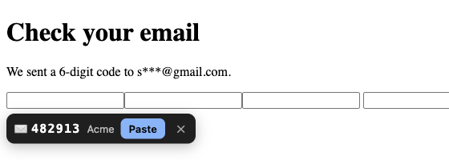

# Gmail OTP Fill

A Chrome extension for sites that email you a sign-in code. It spots the code field, finds the code in your Gmail, and offers to paste it. Nothing fills until you click.



## How it works

- **Spots the field.** It looks for `autocomplete="one-time-code"`, a row of 4–8 one-digit boxes, or a field named like "code", "OTP" or "verify" on a page that mentions email.
- **Checks Gmail.** It reads mail from the last 10 minutes (read-only) and pulls out the code. If an email came from the site you're on, that one wins. Otherwise the newest code wins.
- **Offers it.** A small chip appears under the field. Click **Paste** to fill the field and copy the code to your clipboard. It keeps checking for 3 minutes in case the email is slow.
- **Toolbar button.** Shows the latest code with a Copy button, for pages it doesn't recognize.

## Privacy

- Your mail goes straight from Google to your browser. There's no server, analytics or telemetry.
- It uses **your own** Google OAuth client, so no third party ever gets access to your inbox.
- The scope is `gmail.readonly`. It can't send, delete or change mail.
- Sites only see the code you choose to paste.
- The access token lives in `chrome.storage.session` and is cleared when the browser closes.

## Install

1. Clone this repo, open `chrome://extensions`, turn on **Developer mode**, click **Load unpacked** and pick the folder.
2. The setup page opens from the extension's **Options**. It walks you through creating a Google OAuth client:
   - Create a Google Cloud project and enable the Gmail API.
   - In Google Auth Platform, pick **External** and add your Gmail address as a **test user**.
   - Create a **Web application** client with this redirect URI: `https://mnajiabfjdigihpcnfjjhlpkefioacai.chromiumapp.org/`
   - Paste the client ID, then click **Connect Gmail**.

The `key` in `manifest.json` pins the extension ID, so the redirect URI stays the same wherever you put the folder.

## Develop

```sh
npm test   # code-extraction tests, plain Node, no dependencies
```

To test the chip without Gmail, serve the repo root (`python3 -m http.server`) and open `test/fixture.html`. It stubs `chrome.runtime`.

## License

MIT
