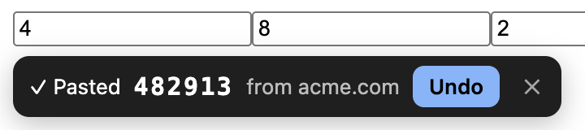

<p align="center">
  
</p>

<h1 align="center">Gmail OTP Fill</h1>

<p align="center">
  Fills email sign-in codes from your Gmail, only on the site that sent them.<br>
  No server. No shared app. Your own Google OAuth client.
</p>

<p align="center">
  <a href="https://github.com/SeanZoR/gmail-otp-fill/actions/workflows/ci.yml"></a>
  <a href="https://github.com/SeanZoR/gmail-otp-fill/releases"></a>
  <a href="LICENSE"></a>
  
</p>

<p align="center">
  
</p>

A site says "we emailed you a code". Normally you switch to Gmail, find the email, copy the code and switch back. With this extension, the code shows up in the field by itself.

## How it works

1. **Spots the field.** It looks for `autocomplete="one-time-code"`, a row of 4–8 one-digit boxes, or a field named like "code" or "verify" on a page that mentions email.
2. **Checks Gmail.** It reads mail from the last 10 minutes (read-only) and finds the code.
3. **Matches the sender to the site.** A code from `stripe.com` is only offered on `*.stripe.com`, and only if Gmail confirms the email really came from there (DMARC).
4. **Fills it.**
   - **Exact match** (main domain, or a subdomain the email links to): pasted automatically, with **Undo**.
   - **Domain match on another subdomain:** a chip with a **Paste** button.
   - **No match:** nothing on the page. The code is in the toolbar popup, with a warning.

It never presses Submit.


## Why it's safe

| Risk | What stops it |
|---|---|
| A phishing page asks for "the code we emailed you" | Codes only go to the sender's own domain. `stripe.help` and `stripe.com.evil.io` get nothing. |
| A forged "From: Stripe" email | Gmail's DMARC result must pass. Display names are ignored. |
| Someone's own `evil.substack.com` | Auto-paste needs the main domain, or a subdomain the email names. |
| A shared OAuth app gets breached | There isn't one. You create your own client, and only you can use it. |
| An update ships bad code | You load it from source. Nothing changes until you pull. |

Access is `gmail.readonly`: it can't send, delete or change mail. Full threat model in [SECURITY.md](SECURITY.md). What's stored and where is in [PRIVACY.md](PRIVACY.md).

## Install

About 5 minutes. **[Step-by-step guide →](docs/SETUP.md)**

1. Download the zip from the [latest release](https://github.com/SeanZoR/gmail-otp-fill/releases), unzip it, and **Load unpacked** at `chrome://extensions`.
2. In Google Cloud, create a project, enable the Gmail API, and add yourself as a test user.
3. Create a **Web application** OAuth client with this redirect URI:
   ```
   https://mnajiabfjdigihpcnfjjhlpkefioacai.chromiumapp.org/
   ```
4. Paste the client ID in the extension's Options and click **Connect Gmail**.

### Why isn't it on the Chrome Web Store?

A store version would need one shared OAuth client with read access to every user's Gmail. That's exactly the kind of single point of failure this project avoids. Each person running their own client is slower to set up, but nobody else holds a key to your inbox.

## Compared with other extensions

Other open-source Gmail code-fill extensions exist, for example [Code_Autofill_Extension](https://github.com/qbeka/Code_Autofill_Extension) and [ghostfill](https://github.com/Xshya19/ghostfill-extension). This one's focus is where the code goes: only to the domain that sent it, only after DMARC passes, and never to a subdomain the email didn't name.

## Develop

```sh
npm install
npm test        # code extraction, domain matching, DMARC, auto-paste rules
npm run lint
npm run build   # dist/gmail-otp-fill-<version>.zip
```

See [CONTRIBUTING.md](CONTRIBUTING.md). The most useful contribution is [a site where it doesn't work](https://github.com/SeanZoR/gmail-otp-fill/issues/new?template=site-not-working.yml).

## License

[MIT](LICENSE)
